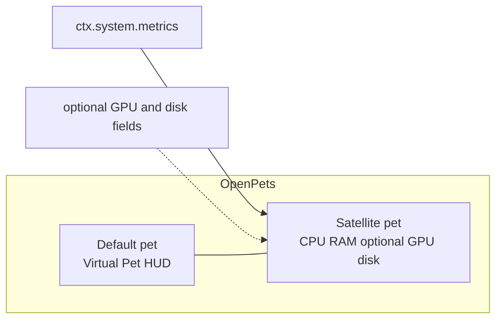

# OpenPets System Resources

[](LICENSE)

<p align="center">
  
  
</p>

Live **CPU and RAM** to the left of your pet. When the host can provide them,
GPU utilization and system-volume disk usage appear alongside them. Virtual Pet
stats (food, energy, play, bond) stay on the pet.

## Catalog package

```bash
npm test
npm run package:catalog
```

Writes `dist/openpets.system-resources-1.5.0.zip` plus a `.sha256` file. The ZIP
contains only the manifest, `index.js`, declared icons, locales, and `LICENSE`.

The plugin reads aggregate, host-provided metrics through `system:metrics`; it
does not start processes or make network requests. GPU and disk values are
omitted when the host cannot provide them.

## Config

- **Language**: automatic / Nederlands / English / Français / Deutsch
- HUD on/off, poll 5–60s, alert threshold, speak on high load

## Commands

- Show / hide resource HUD
- Read resources (or click the pet)

## Development

```bash
npm test
```



When a spawnable installed pet is available, the resource HUD pins on an
ephemeral satellite pet (`SATELLITE_OFFSET_X = -180`). Otherwise it falls back
to a pinned bubble on the default pet without closing or managing that pet.

## License

[MIT](LICENSE) — use, copy, modify, sell: all fine. Keep the copyright notice.
